# Water_Balance

## What is chatbot ?
A bot is a computer program that automates selected tasks by chatting with a user through a conversational interface.
Highly advanced bots are powered by artificial intelligence, constantly learning from user requests and improving its knowledge base with each interaction.

We will build a Water Balance with Watson Assistant..
I’ll show you how to build a chatbot that will help you calculate how much water you and how many Liters — to alert you when you drink enough water. when you don’t that will cause negative effects on your health.

- Step 1: Create Watson Assistant Service 
We need to [sign up on IBM Cloud](https://cloud.ibm.com/registration) to be able to create and use Watson Assistant service. Once you signed in, go to the [Watson Assistant](https://cloud.ibm.com/catalog/services/watson-assistant) page in the IBM Cloud catalog and click Create.

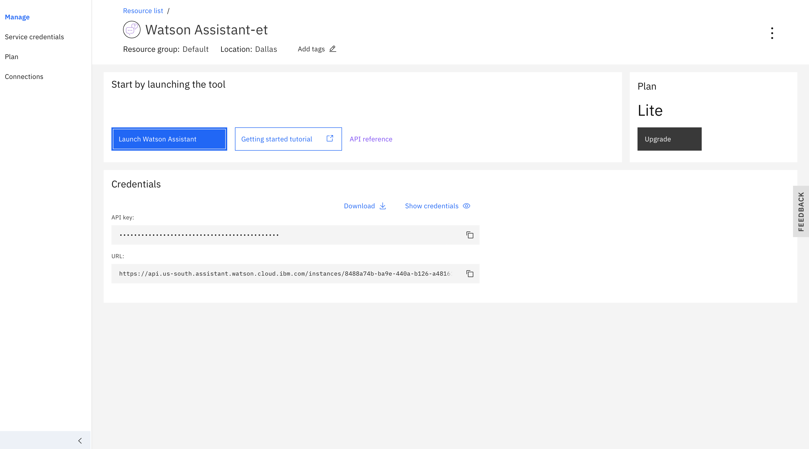

Firstly let me give you an overview picture about how chatbots are built using Watson Assistant.

The assistant must have at least one skill. In the skill, we define what are the users intents from their messages, what entities they could mention and we should pay attention to, and finally design a dialog where we specify responses based on user’s intent and entities.

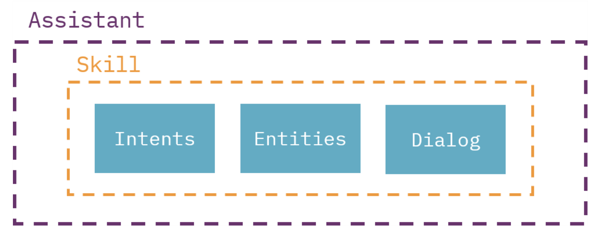

- Step 2: Create Assistant and Skill
Let’s create an assistant so we can start building a skill for our chatbot. We do that by clicking on Create assistant from Assistants tab.

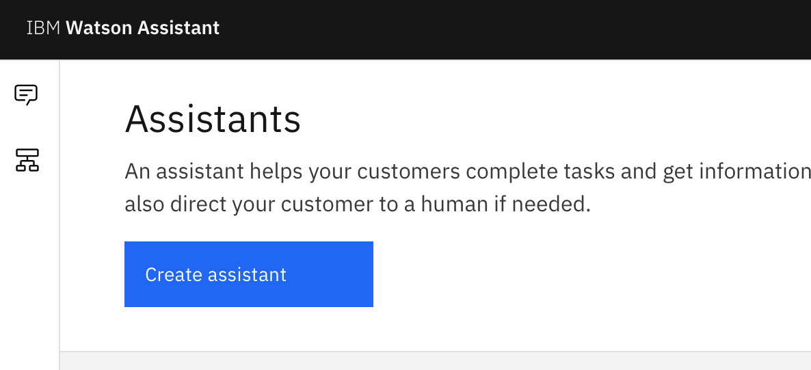

I named it Water Balance, Once you choose a name for yours, go ahead and create a skill by clicking Add dialog skill.

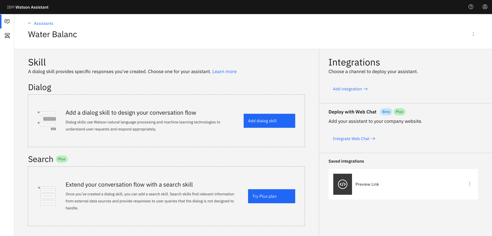

Click **Create skill** tab and enter a name for your skill i.e., Calculation, then click on **Create dialog skill** button to be ready for the next step 🚀

- Step 3: What the user can input?
As we explained earlier, what matters for us to calculate Liters. This can be defined in Watson Assistant by what’s called Entities.

**Entities :** represent information in the user input that is relevant to the user’s purpose

After you open the skill and from the Entities tab, click on **Create entity**.
[For help..](https://cloud.ibm.com/docs/services/assistant?topic=assistant-intents)

Let’s Create entity named Liter and add the value — I added the size of water bottle use [NOVA](https://novawater.com/order-now/?lang=ar)

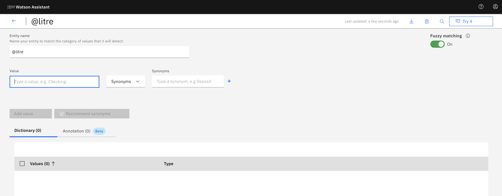

Add one more entity to add for user’s answer when we ask them if they want to get started or add more

- Step 4: Designing the dialog
In the previous step above, we declared the entities that user will enter, but how the bot will response? this is what we will be building in the following steps.

So first click on **Create dialog** from Dialog tab, then you’ll find two nodes by default, one called Welcome for welcoming message and Anything else for responses when the bot doesn’t understand what the user is saying 🤷‍♀️

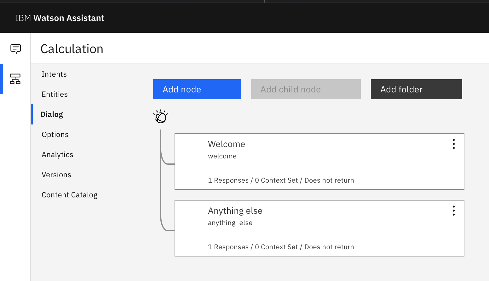

The first thing we need to do is editing the welcome message by clicking on the Welcome node,scroll down to Then respond with, and edit the message as you want.

Now we’ll add two nodes: one to respond when the user answers yes and to calculate water, and one to respond when the user answers no.

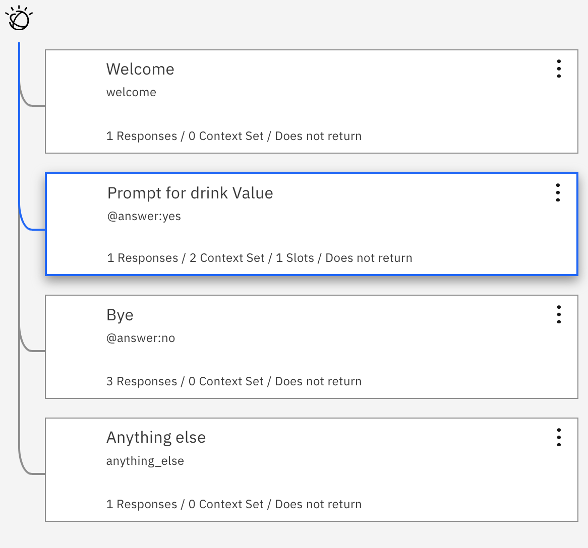

From the Dialog tab click on **Add dialog**. Then, you’ll see a node that has three parts
- name
- condition(s)
- response(s)

For the first node, I will name it Prompt for drink value, and it will respond with Cool, cool. What size? if assistant recognizes @answer:yes.

we need to use something called **context**, a variable that you can change its value during conversation.

In the previous node, click on the three dots on the right of Then respond with then click Open **context editor**. This will add a new section for context variable names and values.

I named it total and initialized it to zero.

We’ll need to add one thing before we move to the second node.

We’ll use **slots** to check if the user mentioned the size. If yes, we will save the value in $Liter context variable. If no, we will ask the user to enter a size.

You can enable slots by clicking on **Customize** button on the right of node’s name. Then switch Slots to **On** and click **Apply**. 

So, overall the node will look like this..

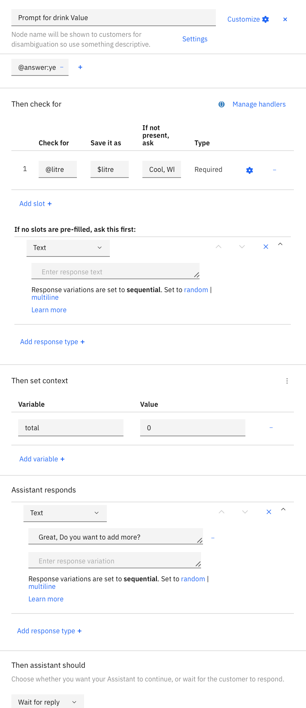

Now, we need to add the last node to response when the assistant recognizes @answer:no, and again we will have multiple responses. So don’t forget to enable Multiple conditioned responses 👌

As you can see, we have three responses:
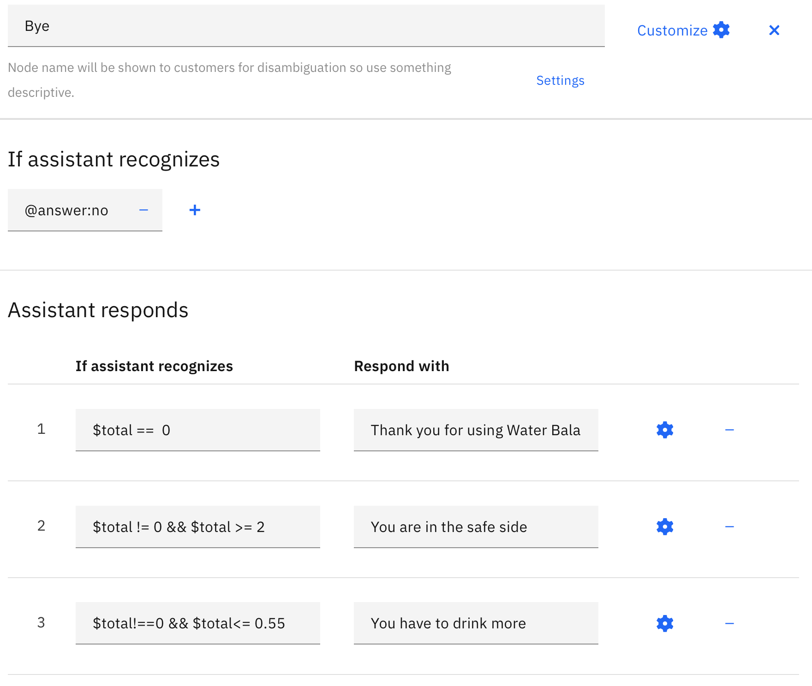

You can test your chatbot now by clicking on **Try it** button on the top right of the page.
And that’s all..

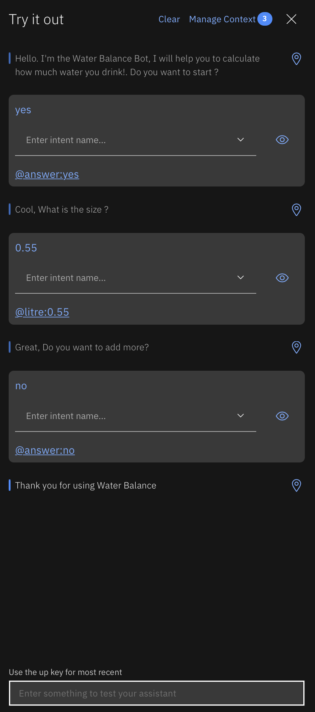

### For you..
- [A Step By Step Guide](https://www.streamcreative.com/chatbot-scripts-examples-templates)

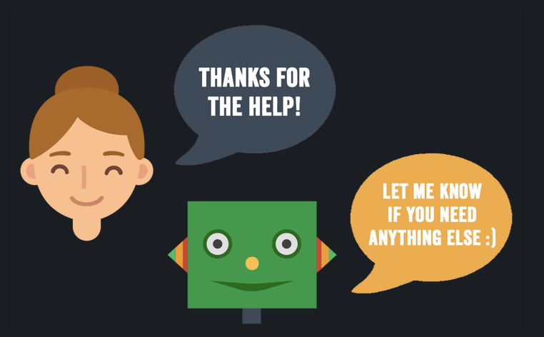